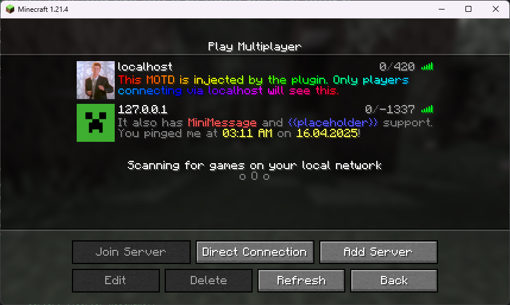

# SmartMotd for Velocity
SmartMotd is a plugin for Velocity that allows you to create dynamic MOTDs (message of the day) for your minecraft 
network. It supports placeholders, colors, and more.

## Configuration
The plugin will create a configuration file in the `plugins/smartmotd` folder.
If you need help configuring the plugin, take a look at the current default configuration in 
[/src/main/resources/config.yml](src/main/resources/config.yml).  
You can also find a list of all supported placeholder there.

## LICENSE
This project is licensed under the MIT License. 
See the [LICENSE](LICENSE) file for details.